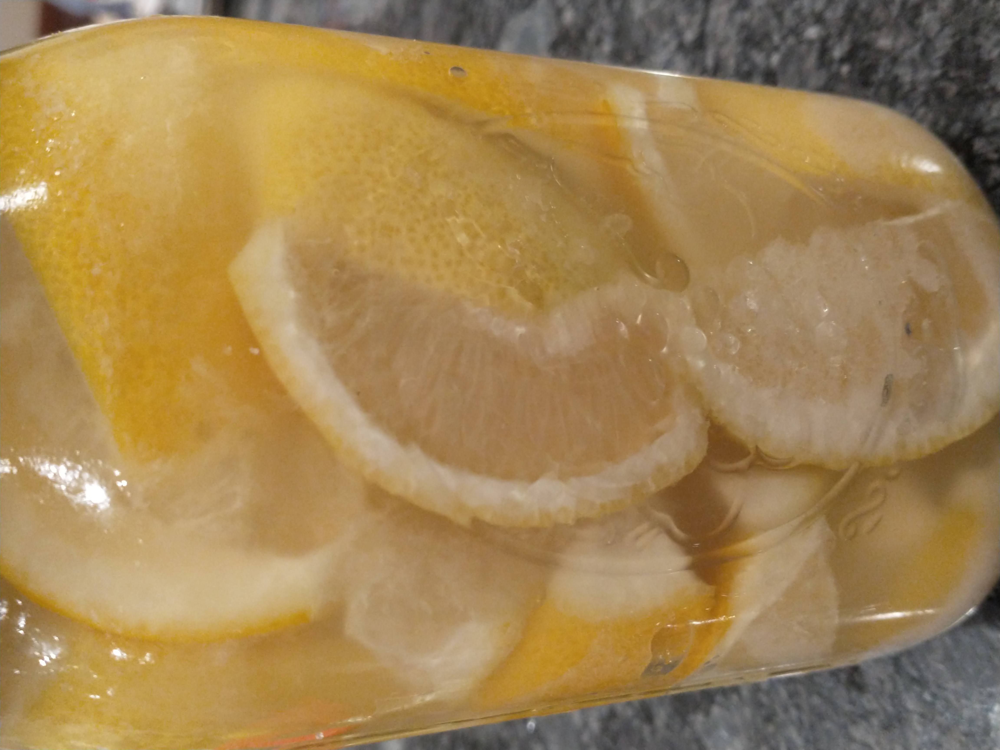

# Preserved Lemons

_Cuisine:  American_ 
_Course:  Condiments_

## Ingredients

- 4 lemons
- 1/4 cup sea salt
- juice of 1 lemon

## Instructions

1. Remove top and tail from **4 lemons**.
1. Slice each lemon into 8 wedges.  Remove seeds and reserve juice.
1. Layer sliced lemons in a clean wide-mouthed jar, sprinkling **salt** on each layer.  Pack tightly.
1. Top jar with any remaining **lemon juice**.  Leave 1/4" head space.
1. Refrigerate for 4 days.  Flip jar and refrigerate for 4 more days.  
1. Rinse lemons wedges before using - or not!  Use within 3 months.

### From

[EveryDayCook](https://altonbrown.com/books/everydaycook/)