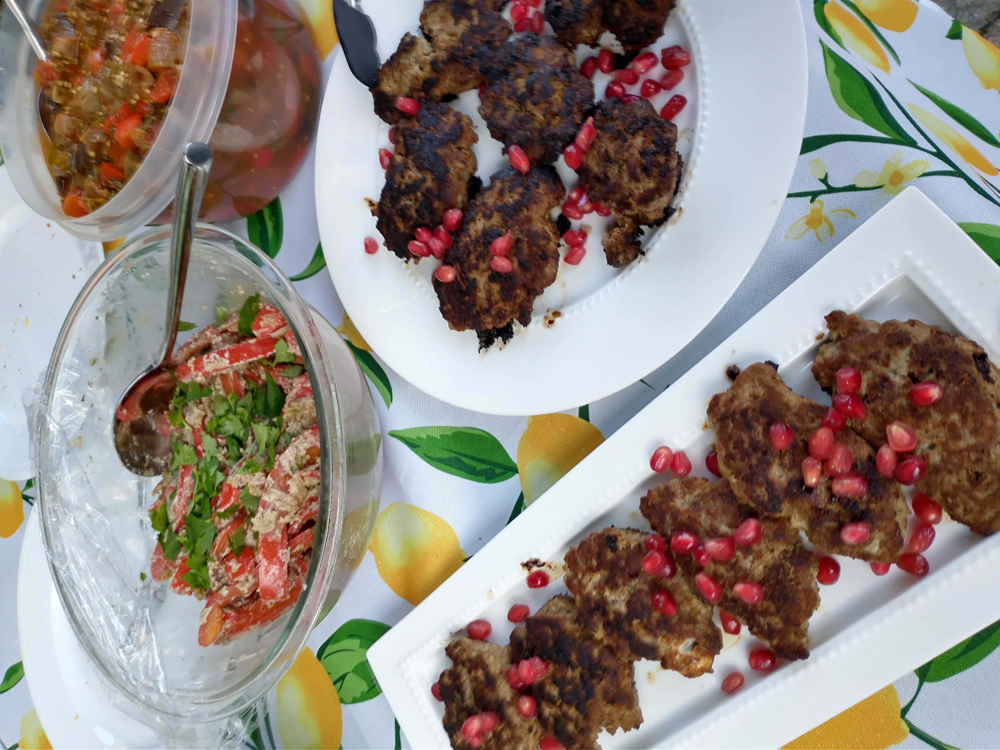

# Kebabi

_Cuisine:  Georgian_

## Ingredients

- 1 tbsp plus 1 tsp sunflower oil
- 2 medium onions, finely chopped
- 500g ground lamb
- 2 cloves garlic, crushed
- 1 tbsp dried basil
- 1/2 tbsp dried mint
- 1 large handful cilantro leaves, chopped
- 1 tsp black pepper
- 1/2 tsp chilli powder
- 1 tsp salt
- 1 tsp tomato paste, dissolved in 1 tbsp hot water
- 1/4 tsp ground caraway seeds
- 4 sheets of lavash
- 3 tsp ajika _(see separate recipe)_
- 1 large handful of parsley, chopped
- 1/2 red onion, finely sliced
- 6 tbsp pomegranate seeds

## Instructions

1. Preheat oven to 400 F and line a large baking sheet with parchment paper.
1. Chop the **onion** and **cilantro** and grind the **garlic** in a mortar and pestle.
1. Heat 1 tsp **oil** in a skillet over medium heat, then add the **onion** and cook until soft, about 5 minutes.
1. Set aside to cool to room temperature.
1. Once onions have cooled, place the **onions**, **lamb**, **herbs**, **spices**, and **tomato paste** in a large bowl, then use your hands to mix through until thoroughly combined.
1. Form into a ball and throw the ball down into the bowl several times.
1. Lighly oil your hands, then divide mixture into 6 even-sized balls.
1. Form the balls into fat sausage shapes with your hands.
1. Heat remaining **oil** in a skillet over medium heat, then add the kebabi to the pan, browning all sides.  Do this in batches to avoid overcrounding the pan.
1. Transfer cooked kebabi to the prepared baking sheet and set aside while you finish the others.
1. Transfer the kebabi to the preheated oven for 18-20 minutes to finish cooking.
1. Serve the kebabi on **lavash** with **red onion**, **ajika**, **pomegranate seeds**, and **parsley**.

### From

[Supra: A feast of Georgian cooking](https://www.amazon.com/Supra-Georgian-Cooking-Tiko-Tuskadze/dp/1911216163)