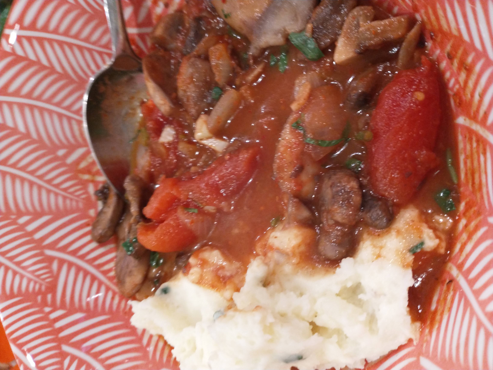

# Mushroom Chashushuli

_Cuisine:  Georgian_
_Course:  Main Course_

## Ingredients

- 2 lbs button mushrooms, quartered
- 1 medium yellow onion, diced
- 25 g (1 cup) fresh cilantro, leaves and stems separated
- 1 green chilli, minced
- 5 cloves garlic, minced
- 2 tbsp red adjika
- 4 tsp tomato paste
- 1 tsp dried savory
- 1 28 oz can whole peeled tomatoes
- 2 bay leaves
- salt and pepper

## Instructions

1. Quarter the **mushrooms**, dice the **onion**, finely chop the **cilantro stems** and **green chilli**, and mince the **garlic**.
1. In a large saucepan over medium heat, heat a tablespoon of neutral oil until shimmering.
1. Add **mushrooms** and cook, stirring occasionally, until they’ve reduced in size and have browned significantly, about 5-10 minutes.
1. Remove from pot and set aside.
1. Add a bit more oil to the pan, reduce the heat to medium-low and add in **onion**, **cilantro stems** and **green chilli**.
1. Cook, stirring occasionally, until softened and lightly translucent, about 5 minutes.
1. Add in **garlic**, **adjika**, **tomato paste** and **savory** and stir constantly until fragrant, only about 30 seconds. Return **mushrooms** to the pot and stir to coat in onion mixture.
1. Pour in **tomatoes** and 400ml (1.5 cups) **water**, add **bay leaves**, stir to combine and bring to a boil before reducing the heat to low and simmering, uncovered, until reduced and thickened, about 30 minutes.
1. Season with **salt** and **pepper**.
1. Chop **cilantro leaves** and stir into the soup.
1. Serve immediately with mashed potatoes.

### From

[No Frills Kitchen](https://nofrillskitchen.com/chashushuli-recipe/)