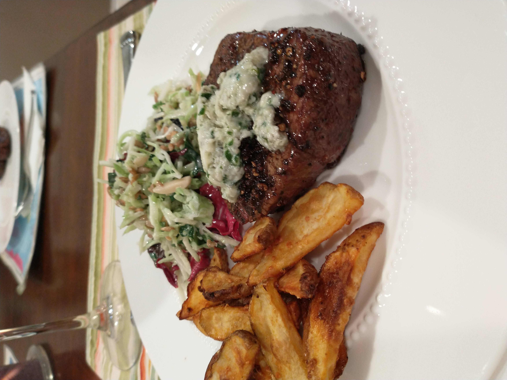

# Pepper Crusted Fillet Mignon

_Cuisine:  American_ 
_Course:  Main Course_

## Ingredients

- 5 tbsp black peppercorsn, crushed
- 5 tbsp plus 2 tsp olive oil
- 1.5 tsp plus 1/8 tsp salt
- 4 7-8 oz center-cut filets mignons, 1.5-2" thick
- 1.5 oz blue cheese
- 3 tbsp butter, softened
- 2 tbsp fresh chives, minced

## Instructions

1. Place 3 tbsp **butter** in a small bowl.  Add 1.5 oz **blue cheese** and let sit at room temperature for 30 min.
1. Spread 2.5 tbsp **black peppercorns** on a cutting board.  Place a skillet on top and press down firmly with both hands.  Using a rocking motion, crush peppercorns, redistributing them as needed.
1. Repeat with another 2.5 tbsp peppercorns.
1. Heat crushed **peppercorns** and 5 tbsp **olive oil** in a small sauce pan over low heat until faint bubbles appear.
1. Continue to cook at a bare simmer, swirling pan occasionally, until pepper is fragrant, 7-10 minutes.
1. Remove pan from heat and set aside to cool.
1. When mixture is at room temperature, add 1.5 tsp **salt** and stir to combine.
1. Rub steaks with **oil and peppper** mixture, thoroughly coating top and bottom of each **steak** with peppercorns.
1. Cover **steaks** with plastic wrap and press gently to make sure **peppercorns** adhere, let stand at room temperature for 1 hour.
1. Meanwhile, add 1/8 tsp **salt** to bowl with softened **butter** and **cheese** and mix with stiff rubber spatula until smooth.
1. Fold in 2 tbps minced **chives**.
1. Place rimmed baking sheet in the oven and heat to 450 F.
1. Heat 2 tsp **olive oil** in a 12" heavy-bottomed skillet over medium-high heat until faint smoke appears.
1. Place **steaks** in skillet.
1. Cook, without moving **steaks**, until dark brown crust has formed, 3-4 minutes.
1. Using tongs, turn **steaks**.
1. Cook until well browned on second side, about 3 minutes.
1. Remove pan from heat.
1. Transfer **steaks** to hot baking sheet.
1. Roast for 3-5 minutes for rare (115 F to 120 F), 5-7 minutes for medium-rare to medium (120 F to 135 F)
1. Transfer **steaks** to wire rack set in second rimmed baking sheet.
1. Spoon 1-2 tbsp **compound butter** over each **steak**.
1. Let rest, tented loosely with foil, for 5 minutes before serving.

## From

[The America's Test Kitchen Cooking School Cookbook: Everything You Need to Know to Become a Great Cook](https://www.amazon.com/Americas-Kitchen-Cooking-School-Cookbook/dp/1936493527)