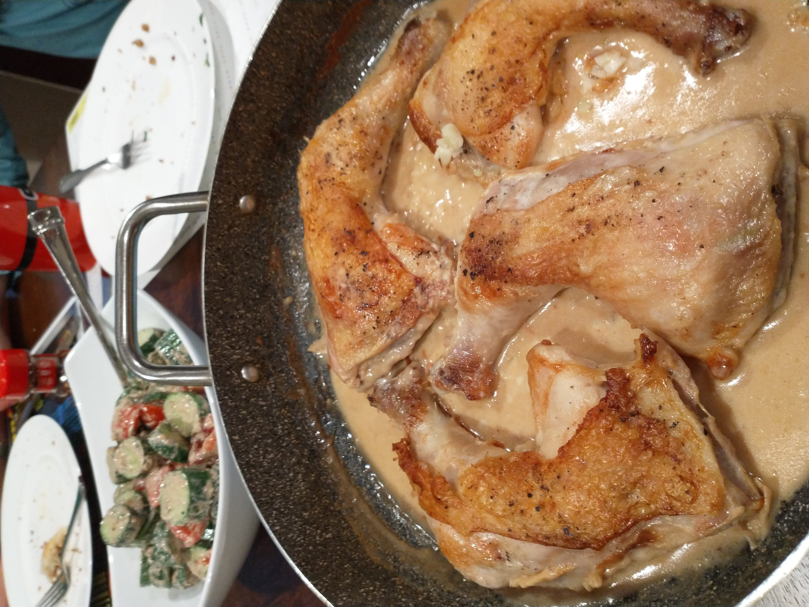

# Shkmeruli Chicken

_Cuisine:  Georgian_ 
_Course:  Main Course_

## Ingredients

- 2 lbs bone-in, skin-on chicken thighs
- 12 cloves garlic, minced
- 1 1/3 cups milk
- 4 tbsp butter
- 1 tbsp sunflower seed oil
- salt and pepper

## Instructions

1. Pre-heat oven to 400F.
1. Apply **salt and pepper** to the **chicken thighs**.
1. Heat 1 tbsp **sunflower seed oil** in a skillet, brown **chicken thighs** skin-side down, 8-10 minutes.
1. Flip and brown the other side for 5-10 minutes.
1. Remove **browned chicken thighs** and place on a plate.
1. Melt **2 tbsp butter** in the same skillet on low heat.
1. Add **garlic** and stir for 30 seconds.
1. Slowly whisk in **milk**.
1. Bring to a simmer, add **chicken**, and bake in the oven for 20 minutes.
1. Remove from the oven, remove **chicken** and plate.
1. Whisk in **2 tbsp butter**.
1. Reduce **sauce** over medium-low heat. _Note: Traditionally, the sauce is rather thin, but I prefer it thick and rich._
1. Pour **reduced sauce** over **chicken**.
1. Serve with **crusty bread** and **Georgian salad**.

## From

Unknown