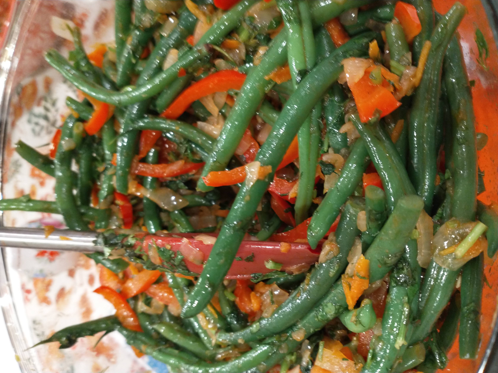

# Mtsvane Lobios Salata

_Cuisine:  Georgian_ 
_Course:  Side Dish_

## Ingredients

- 1 kg (2 lbs) green beans
- 5 cloves garlic
- 150 ml (1/2 cup) sunflower oil
- 3-4 onions, finely chopped
- 1 large carrot, peeled and coursely grated
- 2 red bell peppers, finely sliced
- 1 tbsp tomato paste
- 2 tsp turbinado sugar
- 35 g fresh parsley, chopped
- 35 g fresh dill, chopped
- 35 g fresh cilantro, chopped
- salt and cayanne pepper powder, to taste

## Instructions

1. Bring a large pot of water to a boil.
1. While water is heating up, chop the **onions**, grate the **carrot**, and slice the **red bell peppers**.
1. Peel and smash the **garlic**.  Place in mortar and pestel with a few dashes of **salt** and **cayanne**.
1. When water has come to a boil, add **green beans** and gently simmer for 4 minutes, until tender.
1. Drain **green beans** into a collander and rinse with cold water to stop the cooking.  Set aside.
1. Heat **sunflower oil** in a large pan over medium heat.
1. Add **onion** to the pan and cook, stirring frequently, until soft and starting to turn golden, about 10 minutes.

1. Add the grated **carrot** to the pan and cook, stirring, until softened, about 2 minutes.
1. Add the **red bell peppers** to the pan and cook for another 3 minutes.
1. Push the vegetables to the side of the pan and add the **tomato paste** and **turbinado sugar** to the pan and cook, stirring, until thickened, about 2 minutes.
1. Stir the mixture into the vegitables, then add the **green beans** back into the pan, stirring to combine.
1.  Cook for 5-7 minutes, stirring occassionally.
1. Meanwhile, grind **garlic** into a paste and chop the **parsley**, **cilantro**, and **dill**.
1. Add the **garlic paste** and **fresh herbs** to the pan and cook for 2 minutes.
1. Transfer to a serving platter and serve warm.

## From

[Supra: A feast of Georgian cooking](https://www.amazon.com/Supra-Georgian-Cooking-Tiko-Tuskadze/dp/1911216163)